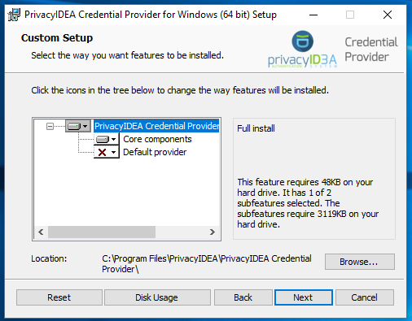
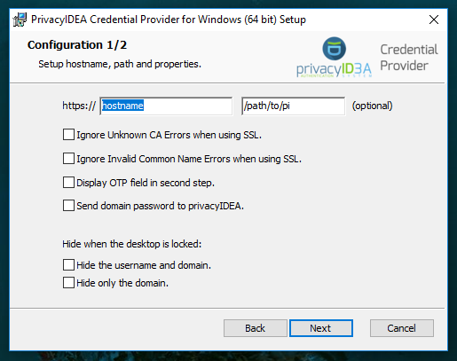

.. _installation:

Installation
============

Prerequisites
-------------

To use the privacyIDEA Credential Provider you need to have a privacyIDEA
Authentication System. The installation and setup of this backend is covered
in another documentation [#privacyideaSetup]_.

Ask the company NetKnights to get an evaluation version of the privacyIDEA
Credential Provider [#contact]_.

MSI package
-----------

The privacyIDEA Credential Provider comes as a 32bit and 64bit MSI package.
You can install it manually or use your software distribution tool.

Start installation
..................



   :width: 500px

   *Installation of privacyIDEA Credential Provider*

In the first step you can decide, if you want to make the privacyIDEA
Credential Provider the default provider. This means, that no other
credential provider is active on this machine. The user can not login with
only his Windows password anymore.

.. note:: We recommend not activating this setting during installation.
   First you should configure the privacyIDEA Credential Provider and
   check, if it works right. After this, you can change the installation and
   change this configuration.

Configure the privacyIDEA Authentication Server
...............................................

In the next step, you can configure the communication to the privacyIDEA
Authentication Server. The credential provider and the server communicate via
the REST API ``POST /validate/check``.

.. note:: You only need to specify the hostname of the authentication server.
   In most cases you only need to enter the hostname like *yourserver.example.com*. Additionally the path can be specified if there is. Something like */path/to/pi*.


   :width: 500px

   *Configure the privacyIDEA Credential Provider*

You can specify a custom **login text**, which will be displayed
underneath the provider.

You can also specify if certain SSL errors shall be ignored.

.. warning:: We recommend NOT to ignore any SSL errors in productive use.
   Otherwise you will be vulnerable to man-in-the-middle attacks.
   An attacker who intercepts the communication could modify the authentication
   response and thus make the second factor useless.

You may specify the path to a custom login image.

.. note:: The image must be a BMP version 3 file.


After these two steps the privacyIDEA Credential Provider is installed on
your system and can be chosen for login.

Manual Installation
-------------------

The privacyIDEA Credential Provider and Filter can also be registered manually.
To do this, the file ``PrivacyIDEACredentialProvider.dll`` has to be put into ``%windir%\System32``.
(If desired, the ``PrivacyIDEACredentialProviderFilter.dll`` can be added aswell).
Next, the privacyIDEA Credential Provider has to be registered to be loaded into the logon process.
This is done by adding its CLSID to the list of Credential Providers at 
``HKLM\SOFTWARE\Microsoft\Windows\CurrentVersion\Authentication\Credential Providers\``.
Add a new key here with the name ``{7BAF541E-F8E0-4EDF-B69A-BD2771139E8E}`` (the CLSID).
Afterwards set the data of the default to ``PrivacyIDEACredentialProvider``.
Finally, the DLL has to be registered with the system. To do this, go to ``HKEY_CLASSES_ROOT\CLSID\``
and add a new key with the CLSID from above. Add another key to the on just created with the name
``InprocServer32``. Set the default data to ``PrivacyIDEACredentialProvider.dll`` and add another 
REG_SZ with the name ``ThreadingModel`` and data ``Apartment``. 
Now the privacyIDEA Credential Provider is registered and should be visible at the next Login attempt.
This can also be done via the file ``RegisterProvider.reg``.

If you wish to also use the privacyIDEA Credential Provider Filter, do the steps above again with the
CLSID of the Filter which is ``{34065473-D75F-4BC2-9782-E98E63ED0D41}`` and registration at
``HKLM\SOFTWARE\Microsoft\Windows\CurrentVersion\Authentication\Credential Provider Filters\``.
Alternativly, the file ``RegisterFilter.reg`` can be used.

To unregister, the corresponding files ``UnregisterXXX.reg`` can be used. 
This does not remove the configuration, DLL files or CLSID entries, it only removes the Provider or Filter
from the Authentication flow at ````HKLM\SOFTWARE\Microsoft\Windows\CurrentVersion\Authentication\``.


.. [#privacyideaSetup] http://privacyidea.readthedocs.io/en/latest/installation/index.html
.. [#contact] https://netknights.it/en/unternehmen/kontakt/

